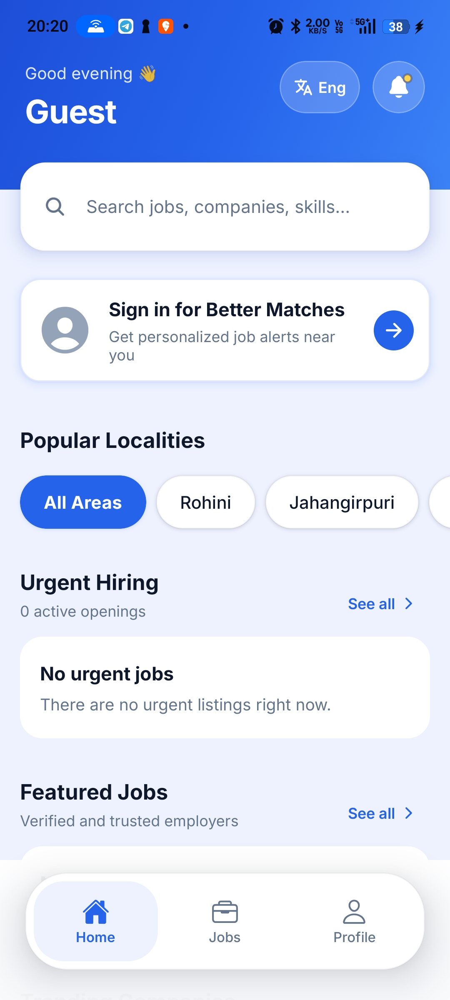
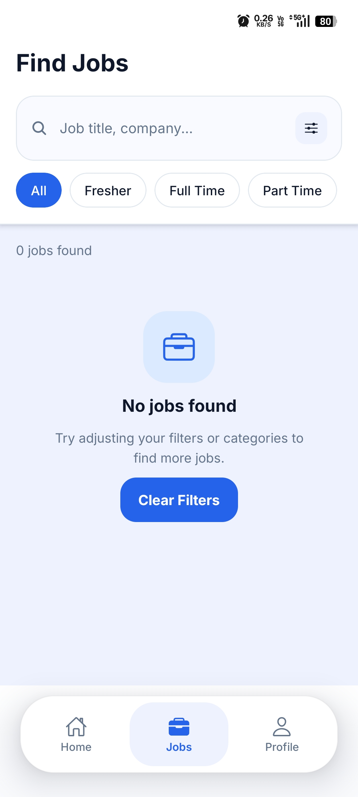
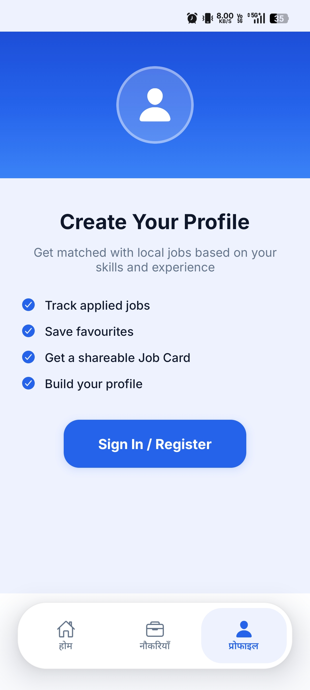
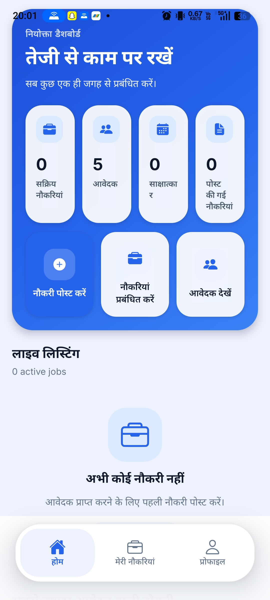

# RozgaarSetu

> Open-source hyperlocal employment platform connecting job seekers with nearby opportunities across India.

## 🌟 Vision

RozgaarSetu aims to make local job discovery simple, accessible, and trustworthy for every job seeker in India.

## 🚨 The Problem

Millions of candidates depend on WhatsApp groups, word-of-mouth, and informal networks to find jobs. Small businesses struggle to reach qualified local candidates.

## 💡 Our Solution

RozgaarSetu bridges the gap between employers and job seekers through a modern, mobile-first platform focused on hyperlocal hiring.

## ✨ Features

- 📍 Hyperlocal job discovery
- 💼 Nearby job recommendations
- ⚡ One-tap job applications
- ❤️ Save jobs
- 🔔 Job notifications
- 🏢 Verified employers
- 📱 Mobile-first design
- 🤖 AI-powered recommendations (planned)

## 📸 Screenshots

### Job Seeker Home

### Jobs Screen

### Candidate Profile

### Employer Dashboard

## 🏗 Architecture

Frontend: React Native + Expo
Backend: Supabase
Authentication: Supabase Auth
Database: PostgreSQL
Hosting: Supabase

## 🚀 Roadmap

### Phase 1 (MVP)
- [x] Job listings
- [x] Job details
- [x] Apply feature

### Phase 2
- [ ] Candidate profiles
- [ ] Employer dashboard
- [ ] Resume builder

### Phase 3
- [ ] AI Job Matching
- [ ] Voice Search
- [ ] Multi-language support

## 🤝 Contributing

Contributions, feedback, and feature suggestions are welcome.

## 📜 License

MIT License
